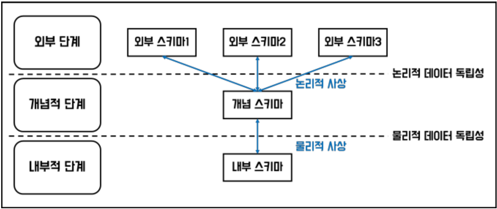

### `데이터 모델링의 이해`

***

#### ① 데이터 모델의 이해

1. `모델링` : 현실 세계를 단순화하여 표현하는 것

   - 특징
     - 추상화 : 일정한 형식에 맞춰 표현함
     - 단순화 : 제한된 표기법이나 언어로 표현함
     - 명확성 : 이해가 쉽게 표현함
   - 관점
     - 데이터 관점 : 업무와 데이터 및 데이터 사이의 관계
     - 프로세스 관점 : 진행되고 있거나 진행되어야 하는 업무
     - 상관 관점 : 데이터에 대한 업무 처리 방식의 영향

2. `데이터 모델링` : 정보 시스템 구축을 위한 데이터 관점의 업무 분석 기법

   - 목적
     1. 정보에 대한 표기법을 통일하여 업무 내용 분석 정확도 증대
     2. 데이터 모델을 기초로 DB 생성
   - 기능
     1. 가시화
     2. 명세화
     3. 구조화된 틀 제공
     4. 문서화
     5. 다양한 관점 제공
     6. 구체화
   - 중요성
     - 파급효과(Leverage)
     - 간결한 표현(Conciseness) : 정보 요구사항과 한계를 간결하게 표현하는 도구
     - 데이터 품질
       - 유일성 : 데이터 중복 저장 방지
       - 유연성 : 데이터 정의와 데이터 사용 프로세스 분리
       - 일관성
   - 이해 관계자
     1. 개발자
     2. DBA
     3. 모델러
     4. 현업 업무 전문가, 완성된 모델을 정확히 해석할 수 있어야 함

3. `데이터 모델링 3단계`

   ➀ 개념적 모델링 : 엔터티와 속성을 도출하고 ERD를 작성함, 업무 중심적이고 포괄적인 수준의 모델링

   ➁ 논리적 모델링 : 식별자를 도출하고 속성과 관계 등을 정의함, 정규화를 수행하여 데이터 모델의 독립성과 재사용성 확보, 논리 데이터 모델은 데이터 모델링 완료 상태

   ➂ 물리적 모델링 : DB를 구축함, 성능 및 보안 등 물리적인 성격 고려

   ⭐️ 프로젝트 생명주기 (Life Cycle) : 계획 > 분석 > 설계 > 개발 > 테스트 > 전환/이행 단계로 구성

   		1) 계획과 분석 단계는 개념적 모델링
   		1) 분석 단계는 논리적 모델링
   		1) 설계 단계는 물리적 모델링

4. `DB의 3단계 구조` : 데이터 독립성 확보를 목표로 함

   

   - DB 독립성의 필요성

     데이터의 중복성과 데이터 복잡도 증가로 인한

     1. 유지보수 비용 증가

     2. 요구사항 대응 저하

   - 3층 스키마(3-level Schema)

     - 외부 스키마
       - 각 사용자 단계의 개인적 DB 스키마
       - 사용자 관점
       - 응용 프로그램이 접근하는 DB를 정의
     - 개념 스키마
       - 조직 전체의 통합된 DB 스키마
       - 설계자 관점
       - *데이터 모델링의 지향점*
     - 내부 스키마
       - 물리적으로 데이터가 저장되는 방법을 표현하는 스키마
       - 개발자 관점
       - 물리적 저장 구조

   - 데이터 독립성

     - 논리적 독립성
       - 외부 스키마가 개념 스키마의 변화에 무관함
       - 논리적 사상 없음
     - 물리적 독립성
       - 개념 스키마가 내부 스키마의 변화에 무관함
       - 물리적 사상 없음

5. `데이터 모델링 3요소`

   - 엔터티
   - 관계
   - 속성

6. `ERD(Entity Relationship Diagram)`

   - 언터티는 사각형
   - 관계는 마름모
   - 속성은 타원형으로 표현, 현실의 데이터 모두 표현 가능
     - 엔터티 도출
     - 엔터티 배치
     - 엔터티 간 관계 설정
     - 관계명 기술
     - 관계차수 표현 : `1:1`, `1:N`, `M:N`
     - 관계 선택 사양 표현 : 필수, 선택

7. 좋은 모델링의 요건

   - 완전성
   - 중복 배제
   - 업무 규칙
   - 데이터 재사용
   - 의사소통
   - 통합성

